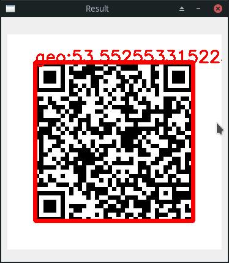
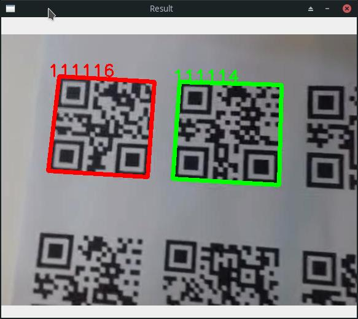

# Detect QRCode OpenCV

Detect QRCode and BarCode using OpenCV in Python

## Features

- Ability to scan **image** and **video** file
- Ability to show live Qr-Code from **webcam**
- Show data text of qr codes **LIVE**
- Show known qr-code with **GREEN** color and unknown with **RED** color

### Programs

- **Image:** highlight QrCodes inside a image
- **Video:** highlight QrCodes in all frames of a video

## Demo

| Test | Test |
| -------------- | -------------- |
|  |  |

Sorry, I don't have printed Qr-Codes to test program well via webcam. (LIVE)

## Using

```bash
$ python image.py
$ python video.py
```
